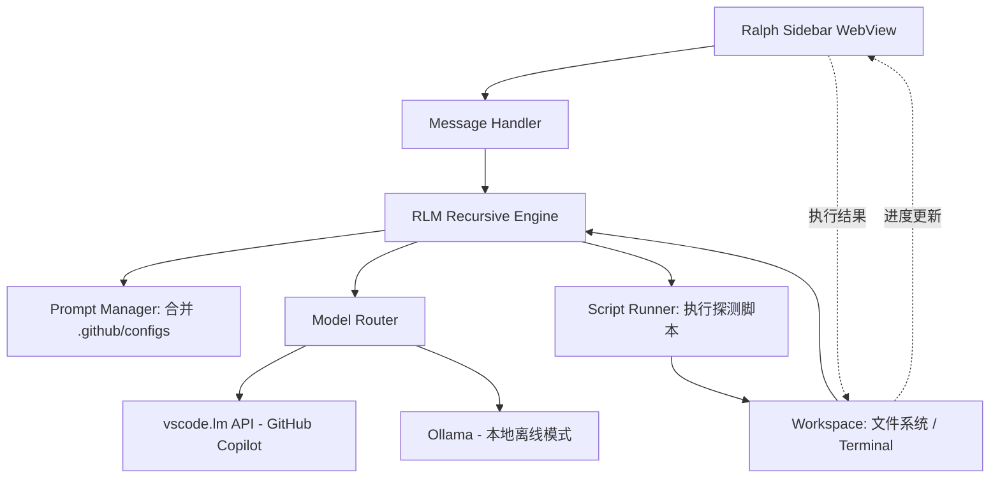

这份计划书旨在将 **RLM (Recursive Language Model)** 的前沿算法与 **VS Code 原生生态** 深度融合，解决企业环境下网络受限、API 计费模式变更以及弱模型推理能力不足的痛点。

---

## 1. 项目目标
*   **突破网络与权限限制**：利用 `vscode.lm` API 穿透企业防火墙，直接调用已授权的 GitHub Copilot Enterprise 模型，无需配置复杂的代理或证书。
*   **优化成本与效能比**：通过 RLM 的“递归迭代”机制，利用免费的低阶模型（如 GPT-4.0/4.1）实现高阶模型（如 Claude 3.5 Sonnet）的推理深度，规避下月起可能产生的额外 credits 消耗。
*   **提升 AI 编码深度**：相比 Copilot Chat 的单次对话模式，本项目通过 RLM 协议让 AI 具备“自主探索代码库”的能力，通过生成脚本 -> 观察结果 -> 递归优化的循环解决复杂逻辑问题。
*   **打造原生集成体验**：彻底告别 CLI 工具的割裂感，提供与 Copilot Chat 一致的内置 UI 交互。

---

## 2. 技术栈
*   **开发语言**：TypeScript。
*   **插件框架**：VS Code Extension API (重点使用 `ChatParticipant`, `ChatModel`, `LanguageModel` 接口)。
*   **核心算法**：RLM (Recursive Language Model) 协议，参考 `opencode-ralph-rlm` 实现。
*   **LLM 驱动**：
    *   **远程**：`vscode.lm` (GitHub Copilot Enterprise)。
    *   **本地**：Ollama API (用于离线或私密开发)。
*   **环境执行**：VS Code 内置 Terminal / Child Process (用于执行 RLM 产生的探测脚本)。

---

## 3. 技术路线
1.  **架构迁移**：将 `opencode-ralph-rlm` 的 RLM 状态机逻辑从 CLI 环境剥离，重构为适用于 VS Code 异步扩展宿主的逻辑。
2.  **模型路由**：实现一个抽象的 Model Provider，在内部通过 `vscode.lm.selectChatModels` 实现内网穿透。
3.  **递归循环 (The Loop)**：
    *   解析模型生成的自定义标签（如 `<execute>`）。
    *   在工作区安全沙盒内执行代码。
    *   将 Stdout/Stderr 拼回上下文发送给下一轮推理。
4.  **环境感知**：利用 VS Code API 自动扫描 `.github/skills` 和指令文件，动态注入 System Prompt。

## 4. 系统架构

**独立面板架构优势**:
- ✅ 完全独立的 UI（不与 Copilot Chat 混淆）
- ✅ 完整可见的递归过程（每一步都展示）
- ✅ 用户可以暂停、调试、修改参数
- ✅ 完整的配置面板和日志查看
- ✅ 实时进度指示和脚本预览

---

## 5. Agent 功能列表
*   **RLM 递归模式**：支持 `/ralph` 命令开启递归解决复杂 Bug 或重构任务。
*   **多 Provider 切换**：支持在 Copilot (免费/付费) 与本地 Ollama 之间无缝切换。
*   **环境自适应**：自动读取并应用工作区内的 `.github/skills`、`prompts` 及 `instructions`。
*   **多步骤计划**：模型在执行前需输出 `plan.md`，供用户预览递归步骤。
*   **安全沙盒预览**：所有生成的脚本在执行前，用户可在 UI 中选择“自动执行”或“手动确认”。

---

## 6. 实施路径

### Milestone 1: 原型验证 (Week 1)
*   搭建 VS Code Chat Participant 基础架子
*   验证 `vscode.lm` 可用性 ✅ 已确认可用
*   能执行简单的 `/ralph hello` 命令

### Milestone 2: 基本循环 (Week 2-3)
*   解构 `opencode-ralph-rlm` 源码，提取状态机和 Prompt 模板
*   实现 RLM 递归状态机（3-5 轮循环）
*   脚本执行和隔离引擎完成

### Milestone 3: 可用 MVP (Week 4-5)
*   实现 `.github/` 配置文件的动态加载
*   集成 Ollama 本地模型支持
*   优化流式展示和递归进度指示
*   端到端测试：解决一个真实的编码问题

---

## 7. 工作量与风险评估

> **详见 [FEASIBILITY.md](FEASIBILITY.md) 获取完整的技术分析、风险评估和实施建议**

### 工作量预估（已优化）
| 模块 | 预估工时 | 状态 |
| :--- | :--- | :--- |
| 基础框架与 `vscode.lm` 适配 | 2 天 | ✅ 低风险（Enterprise 已验证） |
| RLM 递归状态机重构 | 4-5 天 | 🟡 中风险（有参考代码） |
| 脚本解析与执行引擎 | 2.5-3 天 | 🟡 中风险（隔离策略确定） |
| `.github/` 配置自动加载 | 2 天 | ✅ 低风险 |
| UI/UX 调优与进度显示 | 3 天 | ✅ 低风险 |
| **总计** | **15-17 人天** | **3.5 周 MVP** |

### 关键改善（相比初始预估）
- ✅ vscode.lm 企业可用性已验证 → 节省 2-3 天
- ✅ opencode-ralph-rlm 源码已获取 → 节省 1 天
- ✅ 递归深度无限制需求 → 简化 Token 管理，节省 1-2 天
- ✅ 轻型化测试框架 → 节省 1-2 天

### 技术可行性结论

| 维度 | 评级 | 备注 |
|:---|:---|:---|
| **技术成熟度** | ✅ 低风险 | VS Code API 成熟，Copilot Enterprise 可用 |
| **工程难度** | 🟡 中等 | 递归状态机和脚本隔离是主要挑战 |
| **参考代码** | ✅ 高 | opencode-ralph-rlm 源码可参考 |
| **交付风险** | 🟢 低 | 15-17 天可接受，不需额外缓冲 |

详见 [FEASIBILITY.md](FEASIBILITY.md) 获取详细的风险分析、模块可行性和实施建议。